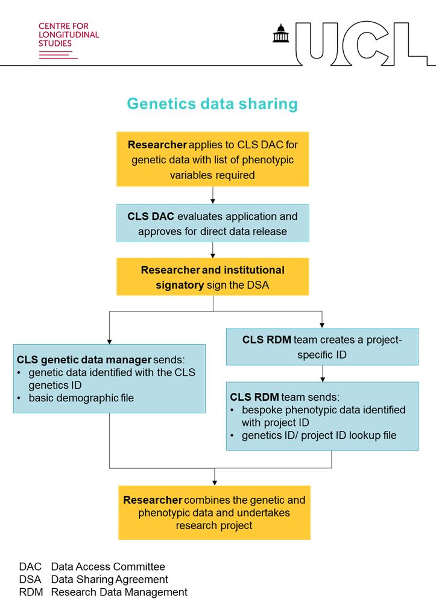
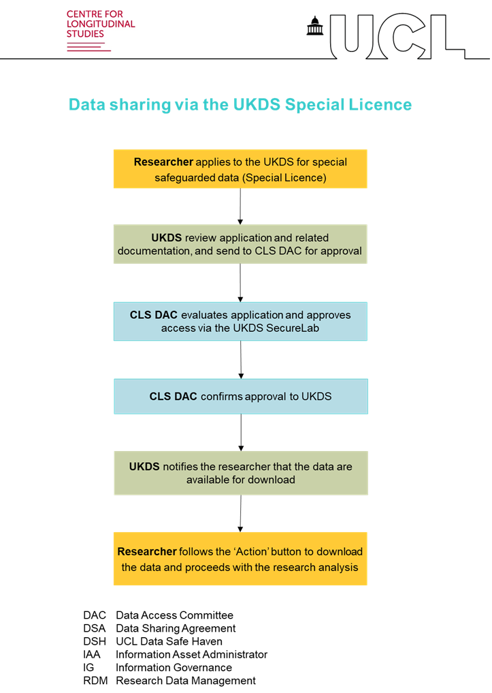

# **Data access** 

Pseudonymised genomic data are available without charge to the global research community upon data application request. 

There are two access procedures depending on the data that you would like to request, as outlined below.

# **Genomewide genetic data (raw and imputed)** 
To access genomewide genetic data, please see the <a href="https://cls.ucl.ac.uk/data-access-training/data-access/">CLS access page</a> (i.e., complete the application form which is then reviewed approximately monthly in data access committee meetings; the same process applies to internal and external applicants).

The <a href="https://cls.ucl.ac.uk/wp-content/uploads/2017/02/CLS_Data_Access_Framework.pdf">CLS Data Access Framework</a> gives further details on the application process, including details on ethics and socially controversial research. Section 8.2 covers data applications via the CLS DAC for genetic data. 

The flowchart below shows the access procedure through the CLS DAC.

# **Polygenic indexes, proteomics and metabolomics** 
Polygenic indexes, proteomics and metabolomics are held by the <a href="https://ukdataservice.ac.uk">UK Data Service</a> under <a  href="https://ukdataservice.ac.uk/find-data/access-conditions/">Special Licence</a>. The data can be applied for directly via the UKDS. 

The <a href="https://cls.ucl.ac.uk/wp-content/uploads/2017/02/CLS_Data_Access_Framework.pdf">CLS Data Access Framework</a> gives further details on the application process, including details on ethics and socially controversial research. Section 7.1 covers data applications via the UKDS for Special Licence  data. 

The flowchart below shows the access procedure through the UKDS.

# **Approved applications** 
A list of direct CLS access applications that have been appoved can be found on the CLS website <a href="https://cls.ucl.ac.uk/wp-content/uploads/2017/02/dac_projects_register.pdf">here</a>.
