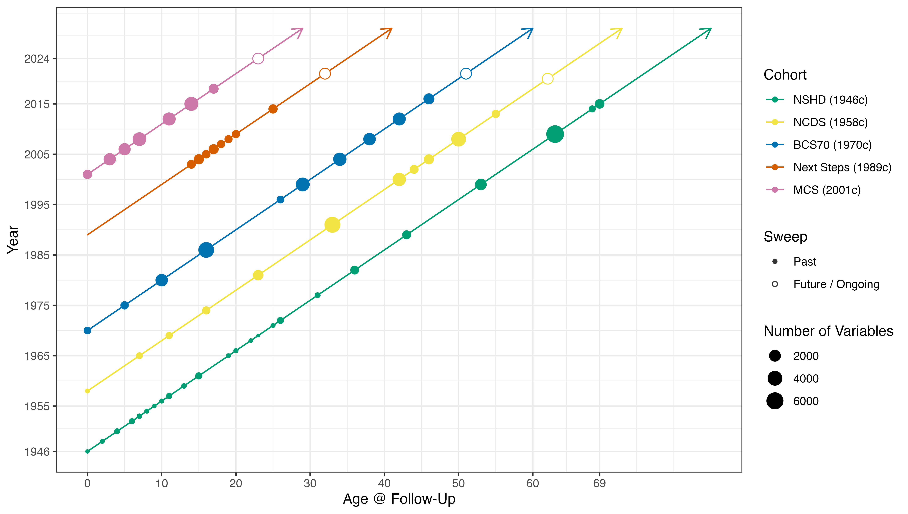

# **Introduction** 

The Centre for Longitudinal Studies ([CLS](https://cls.ucl.ac.uk)) maintains genetic data from four British birth cohorts: the 1958 National Child Development Study (NCDS), the 1970 British Cohort Study (BCS70), Next Steps (1989-90), and the Millennium Cohort Study (MCS, 2000-02). This site provides technical documentation and access information for researchers.

See our resource profile <a href="https://www.medrxiv.org/content/10.1101/2024.11.06.24316761v1">here</a> for background: 

## Data Access

To access genetic data combined with survey data, please see <a href="https://cls.ucl.ac.uk/data-access-training/data-access/">link</a> (i.e., complete the application form which is then reviewed approximately monthly in data access committee meetings; the same process applies to internal and external applicants). The <a href="https://cls.ucl.ac.uk/wp-content/uploads/2017/02/CLS_Data_Access_Framework.pdf">CLS Data Access Framework</a> gives further details on the application process, including details on ethics and socially controversial research. 

A list of approved applications is held <a href="https://cls.ucl.ac.uk/wp-content/uploads/2017/02/dac_projects_register.pdf">here</a>.

## Contribute to GWAS or other consortia

We are happy to contribute to GWAS or other consortia, please [contact us](mailto:clsdata@ucl.ac.uk).

## Genetic data

Please note that there are multiple versions of the genomic data available to researchers. There are two main types of genomic data available to researchers at present: genotype array data and genotype array data imputed to sequence level density. Imputation has been performed several times as new sequenced reference panels become available. We are currently working on imputing all of the CLS genetic data to TOPMed, the most up to date reference panel (<https://topmed.nhlbi.nih.gov/>).  

## Updates:
- **2024**: TOPMed imputation completed across all cohorts
- **Coming 2025**: Polygenic scores for multiple health and social traits ([details](/docs/PRS.html))
